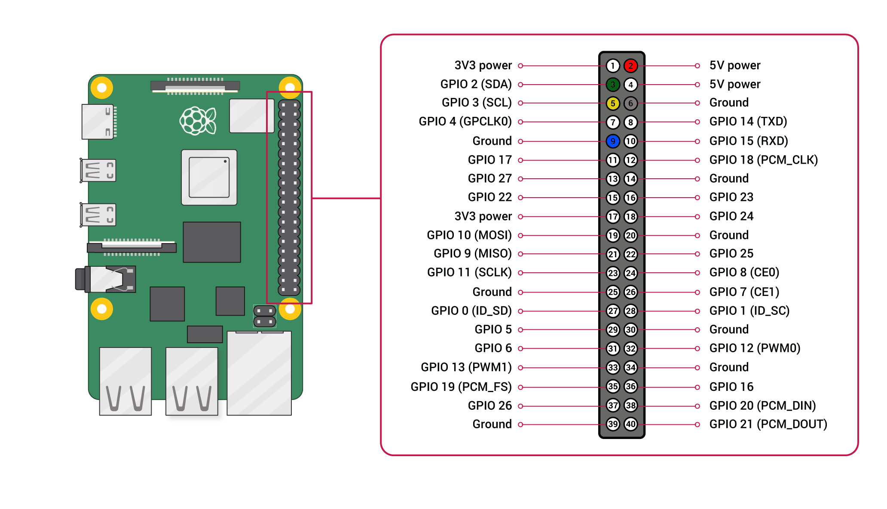

# Sensirion Raspberry Pi I2C SEN5x Driver

This document explains how to set up the Sen5x sensor to run on a Raspberry Pi using the provided code.

<center></center>

## Supported sensors

- SEN50 (only particulate matter signals available)
- SEN54 (no NOx signal available)
- SEN55 (full feature set)

## Setup Guide

### Connecting the Sensor

Your sensor has the five different connectors: VCC, GND, SDA, SCL, SEL (the sixth connector will not be used for now).
Use the following pins to connect your SEN5x:

 *SEN5x*  |    *Raspberry Pi*           |   *Jumper Wire*   |
 :------: | :-------------------------: | :---------------: |
   VCC    |        Pin 2 (5V)           |   Red             |
   GND    |        Pin 6                |   Black           |
   SDA    |        Pin 3                |   Green           |
   SCL    |        Pin 5                |   Yellow          |
   SEL    |        Pin 9 (GND for I2C)  |   Blue            |

<center></center>

<center></center>

| *Pin* | *Name* | *Description*                   | *Comments*                       |
|-------|--------|---------------------------------|----------------------------------|
| 1     | VCC    | Supply Voltage                  | 5V ±10%
| 2     | GND    | Ground                          |
| 3     | SDA    | I2C: Serial data input / output | TTL 5V and LVTTL 3.3V compatible
| 4     | SCL    | I2C: Serial clock input         | TTL 5V and LVTTL 3.3V compatible
| 5     | SEL    | Interface select                | Pull to GND to select I2C
| 6     | NC     | Do not connect                  |

### Raspberry Pi

- [Install the Raspberry Pi OS on to your Raspberry Pi](https://projects.raspberrypi.org/en/projects/raspberry-pi-setting-up)
- [Enable the I2C interface in the raspi-config](https://www.raspberrypi.org/documentation/configuration/raspi-config.md)
- Download the driver for the [Sensirion Github Page](https://github.com/Sensirion/raspberry-pi-i2c-sen5x) and extract the `.zip` on your Raspberry Pi
- Compile the driver
    1. Open a [terminal](https://www.raspberrypi.org/documentation/usage/terminal/?)
    2. Navigate to the driver directory. E.g. `cd ~/raspberry-pi-i2c-sen5x`
    3. Run the `make` command to compile the driver

       Output:
       ```
       rm -f sen5x_i2c_example_usage
       cc -Os -Wall -fstrict-aliasing -Wstrict-aliasing=1 -Wsign-conversion -fPIC -I. -o sen5x_i2c_example_usage  sen5x_i2c.h sen5x_i2c.c sensirion_i2c_hal.h sensirion_i2c.h sensirion_i2c.c \
           sensirion_i2c_hal.c sensirion_config.h sensirion_common.h sensirion_common.c sen5x_i2c_example_usage.c
       ```
- Test your connected sensor
    - Run `./sen5x_i2c_example_usage` in the same directory you used to
      compile the driver.

      Output:
      ```
      Serial number: 213100019
      Product name: 
      Firmware: 1.0, Hardware: 4.0
      Mass concentration pm1p0: 0.0 µg/m³
      Mass concentration pm2p5: 0.0 µg/m³
      Mass concentration pm4p0: 0.0 µg/m³
      Mass concentration pm10p0: 0.0 µg/m³
      Ambient humidity: 39.6 %RH
      Ambient temperature: 28.0 °C
      Voc index: 0.0
      Nox index: 0.0
      Mass concentration pm1p0: 0.0 µg/m³
      Mass concentration pm2p5: 0.0 µg/m³
      Mass concentration pm4p0: 0.0 µg/m³
      Mass concentration pm10p0: 0.0 µg/m³
      Ambient humidity: 39.2 %RH
      Ambient temperature: 30.1 °C
      Voc index: 0.0
      Nox index: 0.0
      ...
      ```
    
    - Wait a few minutes until Voc/NOx index values are stable.

## Troubleshooting

### Building driver failed

If the execution of `make` in the compilation step 3 fails with something like

> -bash: make: command not found

your RaspberryPi likely does not have the build tools installed. Proceed as follows:

```
$ sudo apt-get update
$ sudo apt-get upgrade
$ sudo apt-get install build-essential
```

### Initialization failed

-   Ensure that you connected the sensor correctly: All cables are fully
    plugged in and connected to the correct pin.
-   Ensure that I2C is enabled on the Raspberry Pi. For this redo the steps on
    "Enable the I2C interface in the raspi-config" in the guide above.
-   Ensure that your user account has read and write access to the I2C device.
    If it only works with user root (`sudo ./sen5x_i2c_example_usage`), it's
    typically due to wrong permission settings. See the next chapter how to solve this.

### Missing I2C permissions

If your user is missing access to the I2C interface you should first verfiy
the user belongs to the `i2c` group.

```
$ groups
users input some other groups etc
```
If `i2c` is missing in the list add the user and restart the Raspberry Pi.

```
$ sudo adduser ${USER} i2c
Adding user `pi' to group `i2c' ...
Adding user pi to group i2c
Done.
$ sudo reboot
```

If that did not help you can make globally accessible hardware interfaces
with a udev rule. Only do this if everything else failed and you are
reasonably confident you are the only one having access to your Pi.

Go into the `/etc/udev/rules.d` folder and add a new file named
`local.rules`.
```
$ cd /etc/udev/rules.d/
$ sudo touch local.rules
```
Then add a single line `ACTION=="add", KERNEL=="i2c-[0-1]*", MODE="0666"`
to the file with your favorite editor.
```
$ sudo vi local.rules
```
